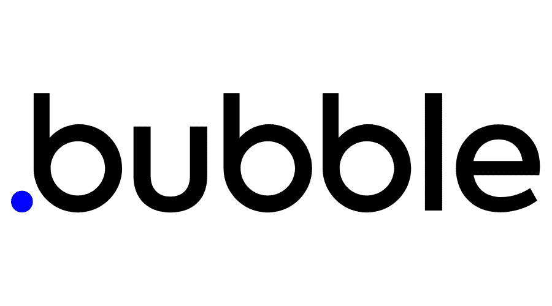

# ⛩️ Ariel Riello ⛩️ 

## 🏷️ Sobre mim:

|Estagiário de Desenvolvimento|Tecnologia da Informação (TI)|
|--|--|
|||

*Uso o GitHub para documentação de estudos e projetos voltados para o aprendizado*

## 🧠 Conhecimentos:

|IDE|Linguagens de Programação|Marcação|Banco de Dados|
|--|--|--|--|
|||||

|Ferramentas|APIs|
|--|--|
|||

## 🎓 Certificados:

|Formações Concluidas|Bootcamps Concluidos|CodeCamps Concluidos|Cursos Concluidos|
|--|--|--|--|
|||||

## ⚙️ Repositórios de Projetos

* [Bot_DIscord_SoL](https://github.com/ArielRiello/Discord_Bot_SoL)
* [My_Review_List_Project](https://github.com/ArielRiello/My_Review_List_Project)

---