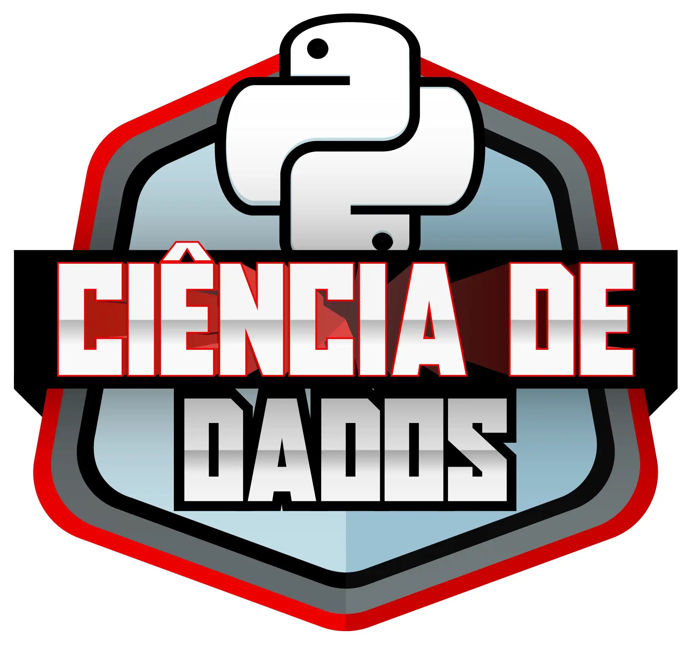
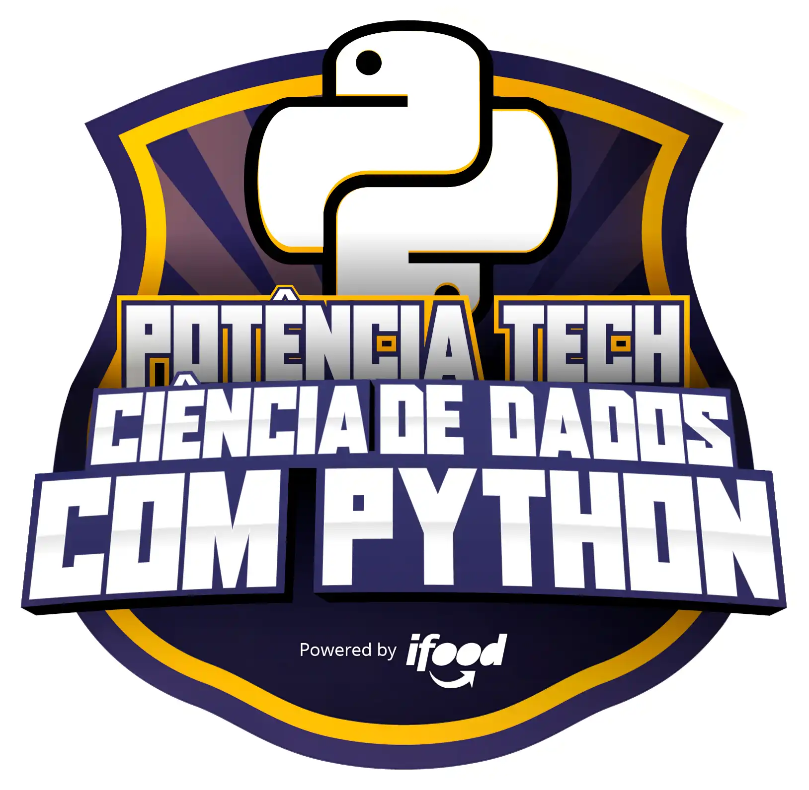
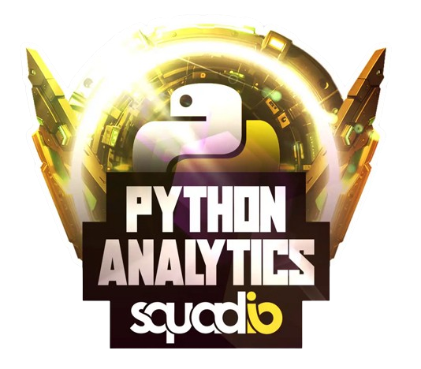
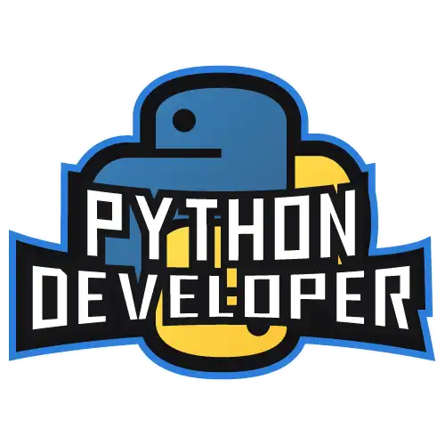
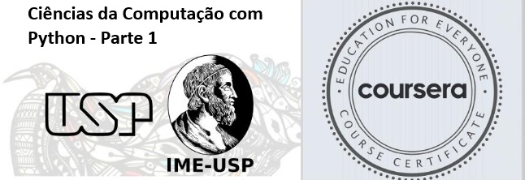

# ⛩️ Ariel Riello ⛩️ 

</a>

<a href="mailto:riello.programmer@gmail.com">
  

---

### 🏷️ Sobre mim:

| Desenvolvedor de Software / Engenheiro de Dados |
|--|
||

*Uso o GitHub para documentar estudos e projetos voltados para o aprendizado / Utilizo repositórios privados para trabalho.*

### 🧠 Conhecimentos:

|IDE|Linguagens|Marcação|Banco de Dados|APIs|Host|
|--|--|--|--|--|--|
||<!-- LINGUAGENS -->|<!-- MARCACAO -->|<!-- BANCO DE DADOS -->|<!-- API -->|<!-- HOST -->|

|Ferramentas|Bibliotecas|SO|
|--|--|--|
||<!-- BIBLIOTECAS -->||

### 🎓 Certificados:

|Bootcamps Concluidos|Formações Concluidas|Cursos Concluidos|
|--|--|--|
||||

|CodeCamps Concluidos|
|--|
|

---

[Repositórios de Certificados e Cursos](https://github.com/ArielRiello/Certificados_Ariel_Riello)

---

### 🚂 Visitantes

---