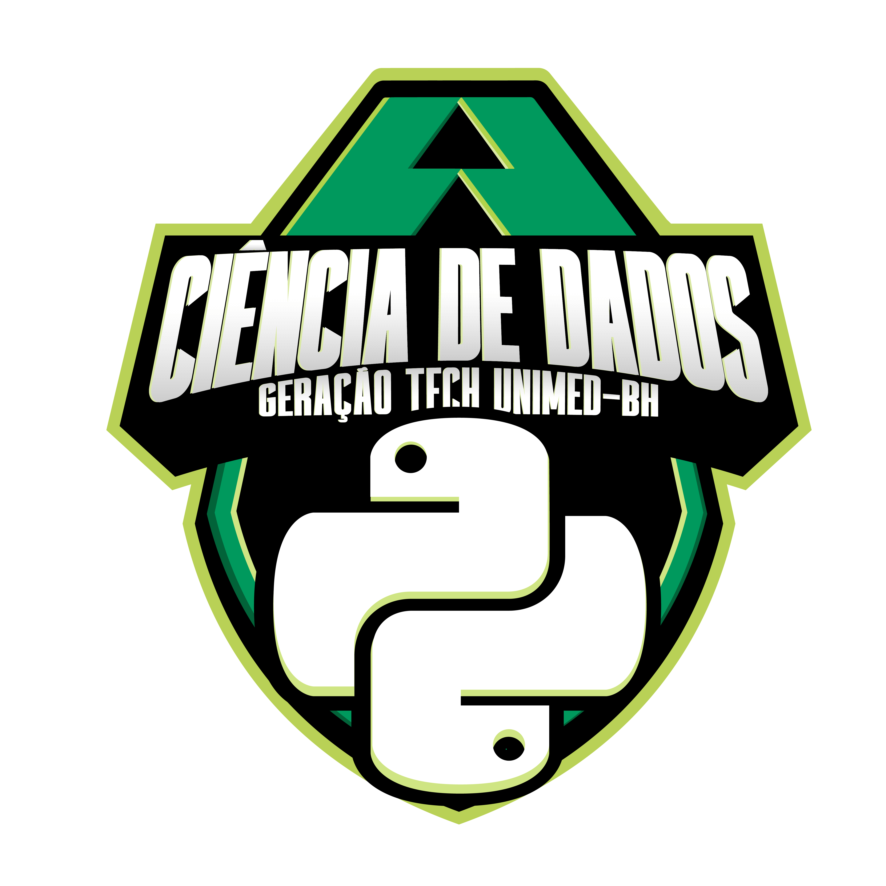
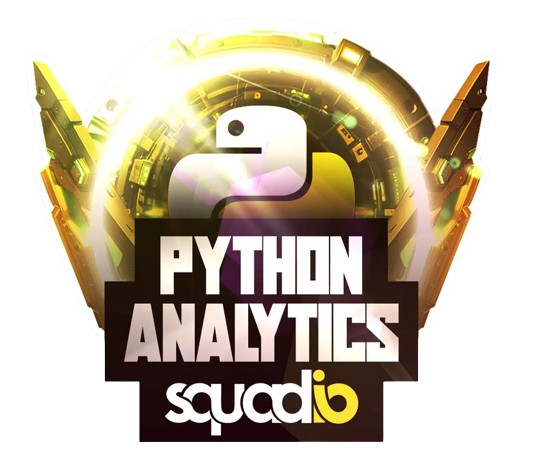
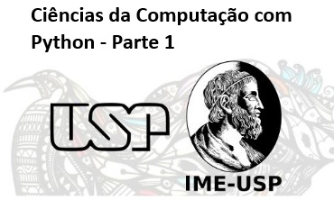

# ⛩️ Ariel Riello ⛩️ 

</a>

<a href="mailto:riello.programmer@gmail.com">
  

### 🏷️ Sobre mim:

|Desenvolvedor de Software|Tecnologia da Informação (TI)|
|--|--|
|||

*Uso o GitHub para documentação de estudos e projetos voltados para o aprendizado*

### 🧠 Conhecimentos:

|IDE|Linguagens|Marcação|Banco de Dados|APIs|Host|
|--|--|--|--|--|--|
|||||||

|Ferramentas|Bibliotecas|
|--|--|
| |

### 🎓 Certificados:

|Bootcamps Concluidos|Formações Concluidas|CodeCamps Concluidos|Cursos Concluidos|
|--|--|--|--|
|||||

[Repositórios de Certificados e Cursos](https://github.com/ArielRiello/Certificados_Ariel_Riello)

---